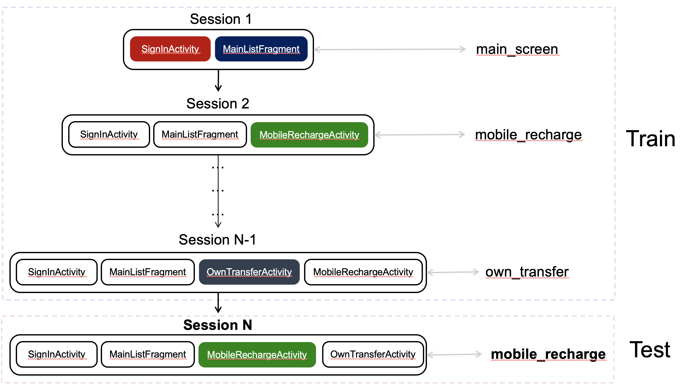
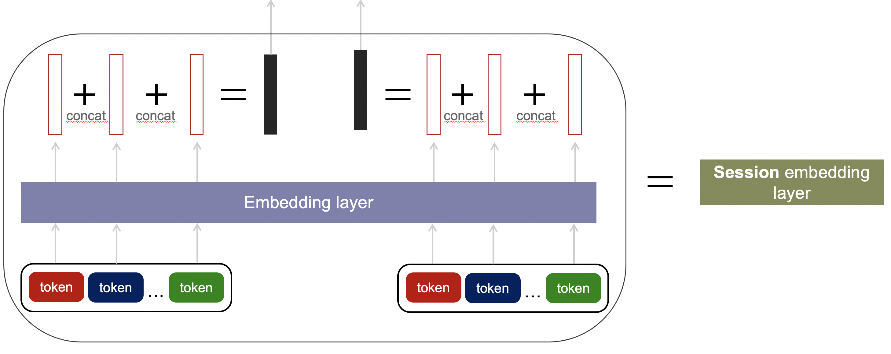
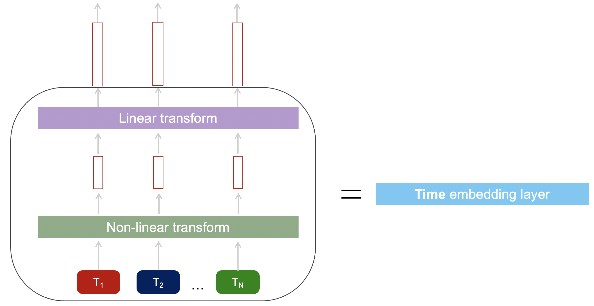
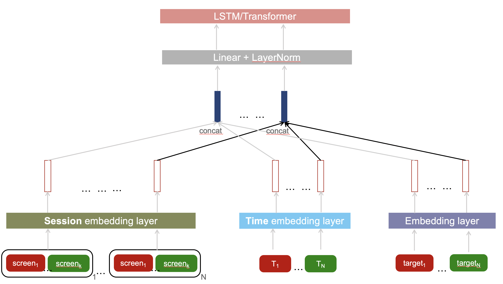

# AlfaBattle2 NN solution

This repository provides code solution for [AlfaBattle2](https://alfabattle.ru/2) task 1 

## Requirements

To install requirements:

```setup
pip install -r requirements.txt
```

## Datasets
[Boosters](https://boosters.pro/championship/alfabattle2/overview)
### Data description
Task is to predict key event in future user session based on the history session data


## Preprocessing and Training
### Prepare data
Pipeline: `get_pop_val_mappers.ipynb -> get_label_encoders.ipynb -> preprocessing_events_to_sessions.ipynb -> preprocessing_train_test.ipynb`

### Train
`rnn.ipynb` for LSTM training and `bert.ipynb` for BERT training

## Solution description
### Session embedding
First problem to overcome — creating embeddings for sessions.  
Each user history consists of sessions and each session consists of events, hence to train our NN we need to create embeddings for sessions using embeddings of events  
  
    
  

Each event has several categorical columns — in our case we use (apply session embedding from pic above): `event_type, event_category, device_screen_name`

### Time embedding
We also want to use `timestamp` feature somehow. Here we apply [time embeddings](https://arxiv.org/abs/1708.00065). We use it with sequences of `session lenghts` and `time differences between sessions`   
  
  
   

### Basic embeddings  
Basic embeddings we apply to sequences of `previous targets` and `net connection types and techs`  

### Everything combined
We take all these embeddings -> concat -> and pass these sequences to LSTM/Transformer models  
  
  
  
